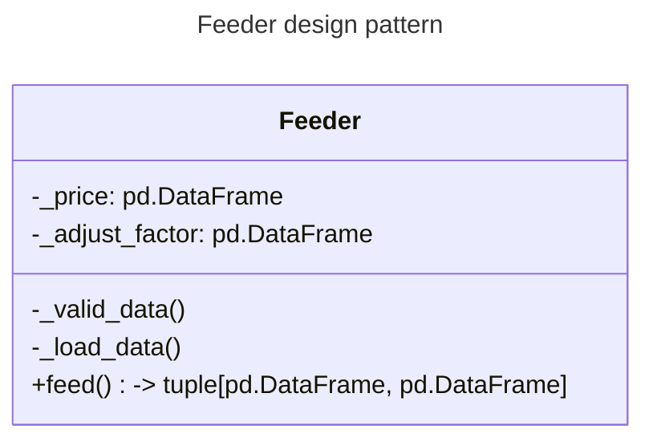
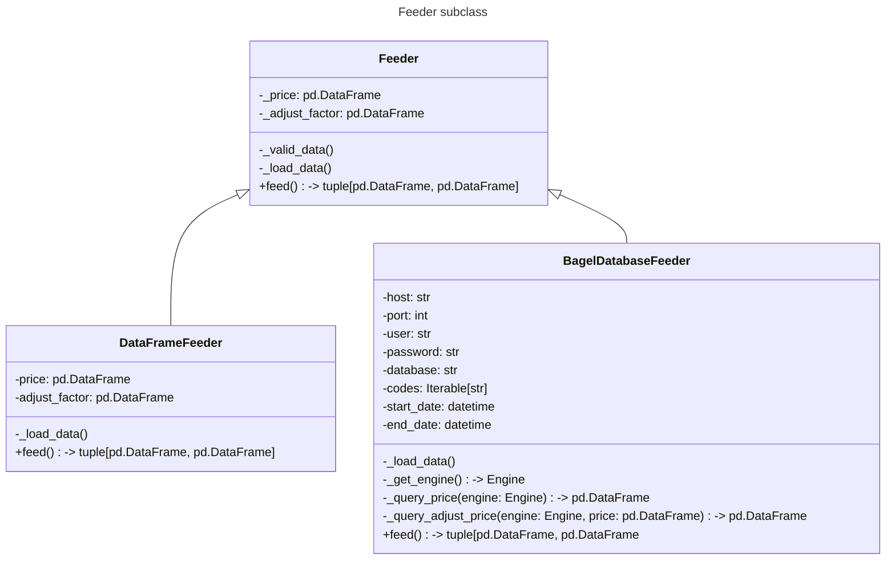

# Feeder

`Feeder` is the first step in the data pipeline. It fetches data from different sources and provides the data to the next step in the pipeline. It provides `price_data` and `adjust_factor` to the next step.

## Design pattern

`Feeder` is designed to be a plugin for `BagelCore`. It is added to `BagelCore` by calling `BagelCore.add_feeder()`. The design pattern is as follows:

## Subclass

