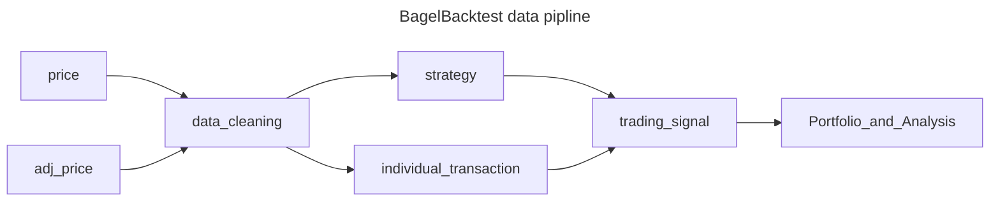

# BagelBacktest

> A Backtesting System for the Chinese Stock Market

## Installation

```shell
pip install BagelBacktest
```

## Data pipline



## Quick Use

Steps for backtest:
1. Create a `Core` -> User interface
2. Set `initial_cash`
3. Add `Feeder` -> Provide price and adj_price
4. Add `Strategy` and `Transaction`:
   - *Optional, `BuyAndHoldStrategy` is set to defauly if no strategy added
5. `Core.run()` -> Generate a `Portfolio` object
6. Using `Analyst` to evaluate `Portfolio` performance

Example:

```python
from BagelBacktest import core, DataFrameFeeder, BuyAndHoldStrategy, Transactions

## Create a `Core`
core = Core()
```